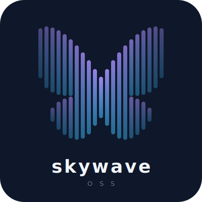

<p align="center">
  
</p>

<p align="center">
  <strong>Turn audio files into waveform videos for Bluesky — no backend required.</strong>
</p>

An open-source, static web app that lets musicians and audio creators share their work on Bluesky with animated waveform visualizations. Everything happens in your browser: no uploads, no server processing, no subscriptions.

## Features

- **Audio to video** — Load any audio file and generate a video with waveform visualization
- **Custom backgrounds** — Add album art or any image as a backdrop
- **Text overlays** — Add track info, lyrics, or captions with markdown support
- **In-browser encoding** — FFmpeg WASM processes everything locally (private & fast)
- **Direct Bluesky posting** — Post your video directly to Bluesky with optional caption text
- **No backend needed** — Fully static site, works offline after first load

## Why SkyWave?

Existing tools like Headliner and Wavve are paid SaaS platforms. Desktop tools like Wav2Bar require installation. SkyWave is free, open-source, and runs entirely in your browser.

Perfect for musicians sharing:
- Track previews & teasers
- Album announcements
- Work-in-progress clips
- Beat snippets
- Podcast audio highlights

## Tech Stack

- **Frontend:** Vite + TypeScript + React (or vanilla JS)
- **Video encoding:** FFmpeg.wasm
- **Bluesky API:** @atproto/api
- **Hosting:** Netlify (or any static host)
- **License:** AGPL-3.0

## Getting Started

### Prerequisites

- Node.js 18+ and npm
- A Bluesky account

### Installation

```bash
# Clone the repo
git clone https://github.com/yourusername/skywave.git
cd skywave

# Install dependencies
npm install

# Start dev server
npm run dev
```

### Usage

1. **Load audio** — Select an audio file (MP3, WAV, etc.)
2. **Customize** — Add background image, text overlay, adjust settings
3. **Preview** — See the waveform animation in real-time
4. **Encode** — Generate the video (MP4, H.264, optimized for Bluesky)
5. **Post** — Sign in with a Bluesky app password and post directly

## Bluesky Video Limits

- **Max duration:** 3 minutes
- **Max file size:** 100 MB (50 MB if under 1 minute)
- **Daily limit:** 25 videos or 10 GB
- **Recommended format:** MP4 + H.264

## Roadmap

See [project_plan.md](./project_plan.md) for the full roadmap. Current priorities:

- **Phase 1:** Branding, logo, landing page
- **Phase 2:** Multiple visualization styles, aspect ratio options, encoding UX
- **Phase 3:** Audio trimming, captions, batch posting
- **Phase 4:** Community features, starter pack, showcase gallery

## Contributing

Contributions welcome! This project is in active development. Check out the [project plan](./project_plan.md) for planned features and open issues.

### Development

```bash
npm run dev          # Start dev server
npm run build        # Build for production
npm run preview      # Preview production build
npm run lint         # Lint code
```

## Security & Privacy

- **No tracking:** We don't collect analytics or user data
- **Local processing:** Audio/video never leaves your device
- **App passwords:** Use dedicated Bluesky app passwords (never your main password)
- **localStorage:** Optional credential storage (opt-in only) for convenience
- Future: OAuth integration when atproto client-side OAuth matures

## License

AGPL-3.0 — See [LICENSE](./LICENSE) for details.

## Acknowledgments

Built for the Bluesky music community. Inspired by Headliner, Wavve, and the need for an open-source alternative.

---

Made with ❤️ for musicians on Bluesky
